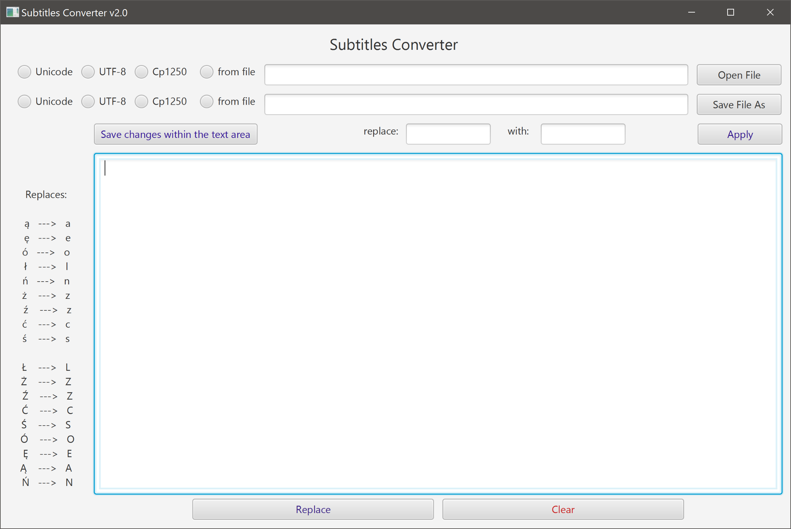
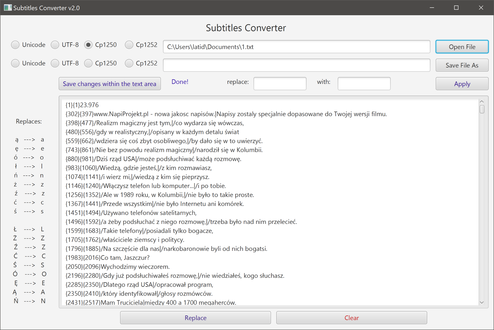
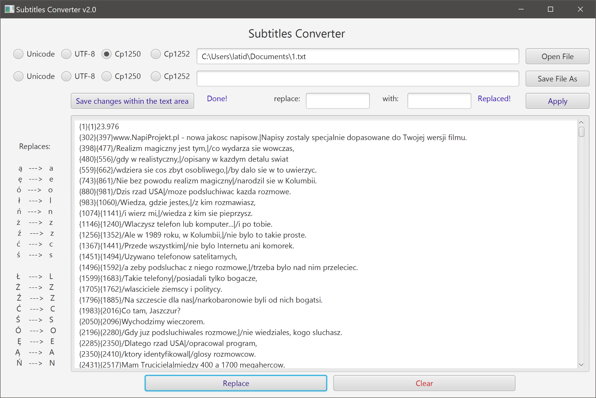
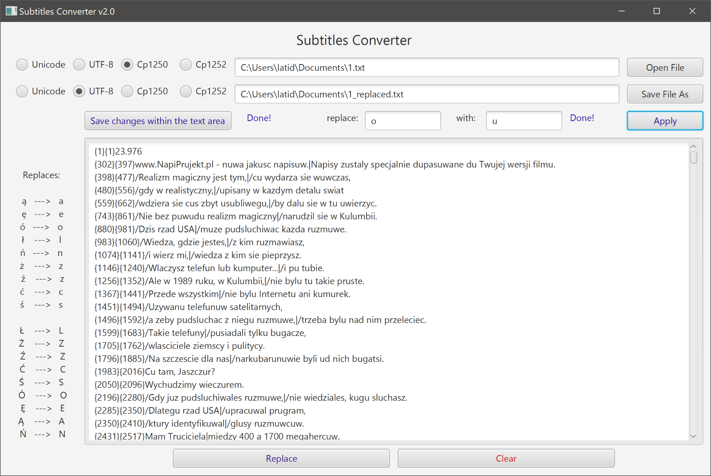

# SubsConverterFX

A UKHO Standard Navigation Chart reader with an option to display charts' coverage.
## Table of contents
* [General Info](#general-info)
* [Screenshots](#screenshots)
* [Technologies](#technologies)
* [Setup](#setup)
* [Launch](#launch)
* [Status](#status)
* [License](#license)
* [Contact](#contact)

# General Info

When watching a movie with Polish subtitles on a system without Polish language installed all the characters specific
 to the Polish langugage are displayed as "\uFFFD" or substituted by a random character outside ASCII code. This 
 obviously disturbs the reading flow (which is crucial when you watch a movie in a foreign language) and takes away a
  little bit of pleasure. 
  
  This simple app tries to remedy that by replacing all the diacritic characters by the  closest equivalent in the 
  ASCII range. For example "ą" is replaced by "a", "ś" by "s", "ł" by "l" and so on, and so forth.
  
  

# Screenshots

	
	
	
	

# Technologies
- Java JDK 1.8
- JavaFX 2.0
- Scene Builder
- started on Eclipse, then switched to IntelliJ IDEA. 

**Plugins and libraries**

- JUnit5  version 5.4.1
- AssertJ version 3.12.2

# Setup

Clone the repository to a folder on your computer and import it in your favourite IDE.

### Build

Run - *mvn clean package* - it creates an executable .jar (with all the dependencies included) as well as a Windows .exe wrapper of the same .jar. Also, necessary folder/file structure is copied next to the executable files (*user.data* folder and its content). All of it is then packed in a ZIP file format for portability as a release version.

# Launch
### Prerequisities
- Java JRE or JDK 1.8.0 or later
- JavaFX if (Java 9 or later used)

### Setup

To start using the app download .exe file from the *release/* folder and double click it. There is no other 
requirements.

# Status
Closed

# License
SubsConverterFX is free software: you can redistribute it and/or modify it under the terms of the GNU General Public 
License as published by the Free Software Foundation, either version 3 of the License, or (at your option) any later version.
SubsConverterFX is distributed in the hope that it will be useful, but WITHOUT ANY WARRANTY; without even the implied warranty of  MERCHANTABILITY or FITNESS FOR A PARTICULAR PURPOSE.  See the GNU General Public License for more details.
You should have received a copy of the GNU General Public License along with SubsConverterFX.  If not, see http://www.gnu.org/licenses/ or write to: latidude99@gmail.com

# Contact
You can email me at latidude99@gmail.com

